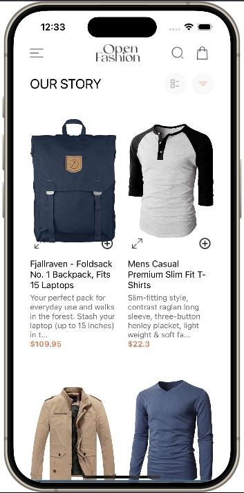

# Open Fashion App

## Overview
The Open Fashion App is a modern and stylish React Native application designed to showcase and sell fashion items. Users can browse products, view detailed descriptions, add items to their cart, and proceed to checkout. The app features a clean design with a focus on user experience, utilizing local storage to save cart items persistently.

## Components
- Home Screen
- Preview Screen
- Cart Screen
- Side Menu

### Home Screen
- **Description**: The home screen serves as the main interface where users can view a selection of fashion items. It includes a navigation header, a product list, and options to filter and view items.
- **Usage**: Users can scroll through the product list, add items to their cart, and navigate to the preview or cart screens.
- **Screenshot**:  
  
  
  

### Preview Screen
- **Description**: The preview screen displays detailed information about a selected product, including images, descriptions, materials, care points, and shipping information.
- **Usage**: Users can view detailed product information and add the item to their cart from this screen.
- **Screenshot**:  
  
  
  

### Cart Screen
- **Description**: The cart screen displays the items added to the user's cart. It includes options to remove items and proceed to checkout.
- **Usage**: Users can view their selected items, adjust quantities, and remove items from the cart.
- **Screenshot**:  
  
  

### Side Menu
- **Description**: The side menu provides additional navigation options such as links to different categories and pages.
- **Usage**: Users can open the side menu by clicking the menu icon, which slides in from the left covering about one-third of the screen.
- **Screenshot**:  
  

## Installation and Setup
1. Clone the repository:
   ```bash
   git clone https://github.com/samuelGyasiFordjour/-rn-assignment6-11053488.git

## Student ID: 11053488